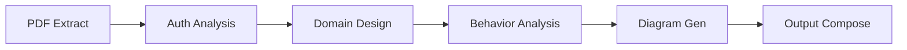
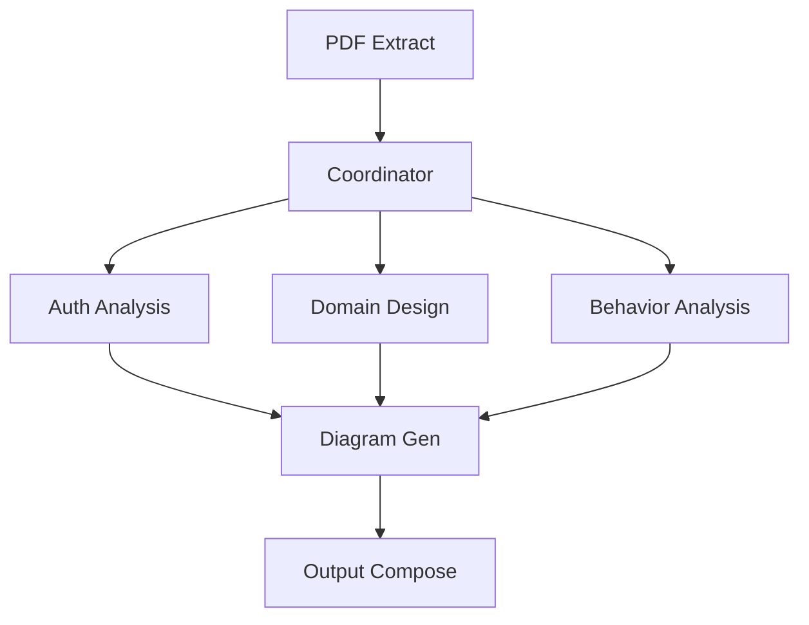
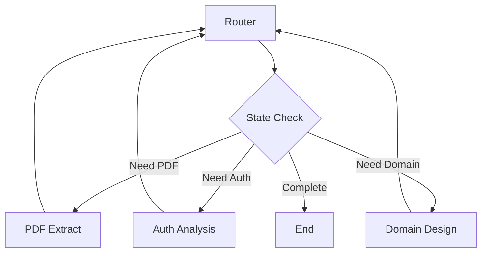

# DesignMind GenAI - LangGraph Edition 🚀

**Next-Generation AI-Powered High-Level Design Generator** using LangGraph workflows to transform Product Requirements Documents (PRDs) into comprehensive architectural documentation with visual diagrams.

[](https://python.org)
[](https://github.com/langchain-ai/langgraph)
[](https://streamlit.io)
[](https://ai.google.dev)

## 🎯 What's New in LangGraph Edition

### **🔄 Advanced Workflow Orchestration**
- **LangGraph Integration**: Sophisticated state management and workflow orchestration
- **Multiple Workflow Types**: Sequential, Parallel, and Conditional execution modes
- **Real-time State Tracking**: Live progress monitoring and error handling
- **Async Support**: Non-blocking workflow execution with streaming updates

### **🏗️ Improved Architecture**
- **Modular Agent System**: Specialized AI agents for each processing stage
- **Type-Safe State Management**: Pydantic models for robust data validation
- **Error Recovery**: Intelligent retry mechanisms and graceful degradation
- **Scalable Design**: Easy to extend with new agents and workflow stages

## 🌟 Key Features

### 🤖 **AI-Powered Analysis Pipeline**
- **📋 PDF Extraction** → Structured markdown from requirements
- **🔐 Security Analysis** → Authentication flows, threats, integrations
- **🏗️ Domain Modeling** → Entities, relationships, API specifications
- **⚡ Quality Engineering** → Use cases, NFRs, risk assessment
- **📊 Visual Generation** → Class and sequence diagrams
- **📄 Documentation** → Professional HLD outputs

### 🔄 **Flexible Workflow Modes**

#### **Sequential Workflow** (Default)


#### **Parallel Workflow** (Faster)


#### **Conditional Workflow** (Smart)


## 🚀 Quick Start

### Prerequisites
- **Python 3.8+**
- **Google Gemini API Keys** (4 keys recommended)
- **Internet connection** (for Kroki diagram rendering)

### 1. Clone & Install
```bash
git clone https://github.com/Amruth22/DesignMind_GenAI_LangGraph.git
cd DesignMind_GenAI_LangGraph
pip install -r requirements.txt
```

### 2. Configure Environment
```bash
# Copy and edit environment file
cp .env.example .env

# Add your Gemini API keys
GEMINI_API_KEY=your_primary_key
GEMINI_API_KEY_1=your_auth_key
GEMINI_API_KEY_2=your_behavior_key
GEMINI_API_KEY_3=your_domain_key
GEMINI_API_KEY_4=your_pdf_key
```

### 3. Add Requirements
```bash
# Place PDF files in data directory
mkdir -p data
cp your-requirements.pdf data/
```

### 4. Run Application
```bash
streamlit run main.py
```

Visit `http://localhost:8501` to access the application.

## 🏗️ Architecture Overview

### **📁 Project Structure**
```
DesignMind_GenAI_LangGraph/
├── 🤖 agent/                    # AI Agent System
│   ├── base_agent.py           # Base agent with common functionality
│   ├── pdf_agent.py            # PDF extraction specialist
│   ├── auth_agent.py           # Security & integrations analyst
│   ├── domain_agent.py         # Domain modeling expert
│   ├── behavior_agent.py       # Behavior & quality specialist
│   ├── diagram_agent.py        # Diagram generation coordinator
│   └── output_agent.py         # Output composition manager
├── 🔄 workflow/                 # LangGraph Workflows
│   ├── hld_workflow.py         # Main workflow orchestrator
│   ├── nodes.py                # Workflow node definitions
│   └── graph.py                # Graph construction logic
├── 📊 state/                    # State Management
│   ├── models.py               # Pydantic state models
│   └── schema.py               # Validation schemas
├── 🛠️ utils/                    # Utility Functions
│   ├── diagram_converter.py    # Plan → Mermaid conversion
│   ├── diagram_renderer.py     # Mermaid → Images
│   ├── compose_output.py       # HLD markdown generation
│   └── risk_heatmap.py         # Risk visualization
├── 📁 data/                     # Input PDF requirements
├── 📁 output/                   # Generated HLD artifacts
├── 🎨 main.py                   # Streamlit application
└── 📋 requirements.txt          # Dependencies
```

### **🤖 Agent System**

Each agent is a specialized AI component with specific responsibilities:

| Agent | Purpose | API Key | Output |
|-------|---------|---------|--------|
| **PDFAgent** | Extract structured content from PDFs | `GEMINI_API_KEY_4` | Markdown requirements |
| **AuthAgent** | Analyze security and integrations | `GEMINI_API_KEY_1` | Auth flows, threats, systems |
| **DomainAgent** | Design entities and APIs | `GEMINI_API_KEY_3` | Domain model, API specs |
| **BehaviorAgent** | Generate use cases and quality attributes | `GEMINI_API_KEY_2` | Use cases, NFRs, risks |
| **DiagramAgent** | Convert plans to visual diagrams | N/A | Mermaid diagrams, images |
| **OutputAgent** | Compose final documentation | N/A | HLD markdown, HTML |

### **📊 State Management**

LangGraph state flows through the workflow with type safety:

```python
class HLDState(BaseModel):
    # Input
    pdf_path: str
    requirement_name: str
    config: Dict[str, Any]
    
    # Processing status
    status: Dict[str, ProcessingStatus]
    
    # Stage results
    extracted: Optional[ExtractedContent]
    authentication: Optional[AuthenticationData]
    integrations: List[IntegrationData]
    domain: Optional[DomainData]
    behavior: Optional[BehaviorData]
    diagrams: Optional[DiagramData]
    output: Optional[OutputData]
    
    # Error handling
    errors: List[str]
    warnings: List[str]
```

## 🎨 User Interface

### **🖥️ Streamlit Dashboard**
- **📁 PDF Selection**: Browse and select requirements documents
- **⚙️ Workflow Configuration**: Choose execution mode and settings
- **📊 Real-time Progress**: Live status updates and error tracking
- **🎯 Rich Visualization**: Interactive diagrams and data tables
- **💾 Export Options**: Multiple output formats (MD, HTML, images)

### **📊 Workflow Monitoring**
- **Stage Status**: Real-time progress tracking
- **Error Handling**: Detailed error messages and recovery suggestions
- **Performance Metrics**: Processing time and resource usage
- **State Inspection**: Full workflow state visibility

## 🔧 Advanced Configuration

### **🔄 Workflow Types**

#### Sequential (Reliable)
```python
workflow = create_hld_workflow("sequential")
result = workflow.run(input_data)
```

#### Parallel (Fast)
```python
workflow = create_hld_workflow("parallel")
result = workflow.run(input_data)  # Auth, Domain, Behavior run concurrently
```

#### Conditional (Smart)
```python
workflow = create_hld_workflow("conditional")
result = workflow.run(input_data)  # Dynamic routing based on state
```

### **⚙️ Configuration Options**

```python
config = ConfigSchema(
    render_images=True,          # Generate diagram images
    image_format="png",          # "svg" | "png"
    renderer="kroki",            # "kroki" | "mmdc"
    theme="default",             # "default" | "neutral" | "dark"
    save_sources=True            # Save .mmd source files
)
```

### **🔄 Async Execution**

```python
# Async workflow execution
result = await workflow.arun(input_data)

# Streaming updates
async for update in workflow.stream(input_data):
    print(f"Stage: {update.get('stage')}, Status: {update.get('status')}")
```

## 📊 Output Artifacts

### **📁 Generated Structure**
```
output/Requirement-Name/
├── 📄 json/                    # Raw AI responses
│   ├── extracted.json         # PDF extraction
│   ├── auth_integrations.json # Security analysis
│   ├── domain_api_designer.json # Domain model
│   └── behavior_quality.json  # Behavior & quality
├── 📊 diagrams/               # Visual artifacts
│   ├── 🖼️ img/               # Generated images
│   ├── diagram_class.mmd     # Class diagram source
│   ├── diagram_seq_*.mmd     # Sequence diagrams
│   └── full_diagrams.html    # Interactive viewer
└── 📋 hld/                   # Final documentation
    ├── HLD.md               # Markdown version
    ├── HLD.html             # Printable HTML
    └── risk_heatmap.png     # Risk visualization
```

### **📄 Document Types**
- **📋 HLD.md**: Comprehensive markdown documentation
- **🌐 HLD.html**: Printable HTML with embedded diagrams
- **📊 Diagrams.html**: Interactive diagram viewer
- **🎯 Risk Heatmap**: Visual risk assessment matrix

## 🧪 Testing

### **🔬 Test Suite**
```bash
# Run all tests
pytest tests.py -v

# Run specific test categories
pytest tests.py::TestWorkflow -v
pytest tests.py::TestAgents -v
pytest tests.py::TestIntegration -v
```

### **🧪 Test Coverage**
- **Unit Tests**: Individual agent functionality
- **Integration Tests**: Workflow orchestration
- **State Tests**: Data model validation
- **Error Tests**: Failure handling and recovery

## 🚀 Performance & Scalability

### **⚡ Performance Features**
- **Parallel Execution**: Concurrent AI agent processing
- **Async Support**: Non-blocking workflow execution
- **State Caching**: Intermediate result preservation
- **Error Recovery**: Automatic retry mechanisms

### **📈 Scalability**
- **Multi-Key Load Balancing**: Distribute across 4 Gemini keys
- **Modular Architecture**: Easy to add new agents
- **Workflow Flexibility**: Multiple execution strategies
- **Resource Optimization**: Efficient memory and API usage

## 🔍 Troubleshooting

### **❌ Common Issues**

**Missing API Keys**
```bash
# Solution: Add all required keys to .env
GEMINI_API_KEY=your_primary_key
GEMINI_API_KEY_1=your_auth_key
# ... etc
```

**Workflow Failures**
```bash
# Check logs for specific agent failures
# Use sequential workflow for debugging
# Verify PDF file accessibility
```

**Diagram Rendering Issues**
```bash
# Test Kroki connectivity
curl -X POST https://kroki.io/mermaid/svg -d "graph TD; A-->B"

# Or install local MMDC
npm install -g @mermaid-js/mermaid-cli
```

### **🔧 Debug Mode**
```python
# Enable detailed logging
import logging
logging.basicConfig(level=logging.DEBUG)

# Use conditional workflow for step-by-step debugging
workflow = create_hld_workflow("conditional")
```

## 🤝 Contributing

### **🛠️ Development Setup**
```bash
# Clone repository
git clone https://github.com/Amruth22/DesignMind_GenAI_LangGraph.git
cd DesignMind_GenAI_LangGraph

# Install development dependencies
pip install -r requirements.txt
pip install pytest black flake8

# Run tests
pytest tests.py -v
```

### **🔄 Adding New Agents**
1. **Create Agent**: Inherit from `BaseAgent`
2. **Implement Methods**: `get_system_prompt()` and `process()`
3. **Add to Workflow**: Update `nodes.py` and `graph.py`
4. **Update State**: Add new data models if needed
5. **Write Tests**: Add comprehensive test coverage

### **📋 Contribution Guidelines**
- **Code Style**: Follow PEP 8 with Black formatting
- **Type Hints**: Use type annotations throughout
- **Documentation**: Update README and docstrings
- **Testing**: Maintain >90% test coverage
- **Error Handling**: Implement robust error recovery

## 📄 License

This project is licensed under the MIT License - see the [LICENSE](LICENSE) file for details.

## 🙏 Acknowledgments

- **LangGraph**: Powerful workflow orchestration framework
- **Google Gemini**: Advanced AI language models
- **Streamlit**: Excellent web application framework
- **Mermaid**: Beautiful diagram syntax and rendering
- **Kroki**: Diagram-as-a-service platform

## 📞 Support

- **🐛 Issues**: [GitHub Issues](https://github.com/Amruth22/DesignMind_GenAI_LangGraph/issues)
- **💬 Discussions**: [GitHub Discussions](https://github.com/Amruth22/DesignMind_GenAI_LangGraph/discussions)
- **📧 Email**: [Contact Author](mailto:amruth22@example.com)

## 🔄 Migration from Original

### **🆕 What's Different**
- **LangGraph Workflows**: Replace manual orchestration
- **Agent Architecture**: Modular, specialized AI components
- **Type Safety**: Pydantic models throughout
- **Better Error Handling**: Robust failure recovery
- **Async Support**: Non-blocking execution
- **Multiple Workflow Types**: Sequential, parallel, conditional

### **🔄 Migration Guide**
1. **Install Dependencies**: New LangGraph requirements
2. **Update Environment**: Same API keys, new structure
3. **Data Migration**: PDF files work as-is
4. **Configuration**: New workflow type options
5. **Output Compatibility**: Same output formats

---

**⭐ Star this repository if you find it helpful!**

**🚀 Experience the future of AI-powered architecture design with LangGraph orchestration!**

Made with ❤️ by [Amruth22](https://github.com/Amruth22)